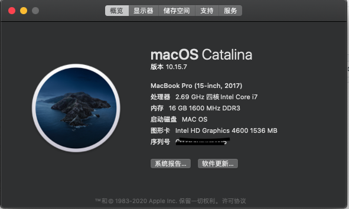
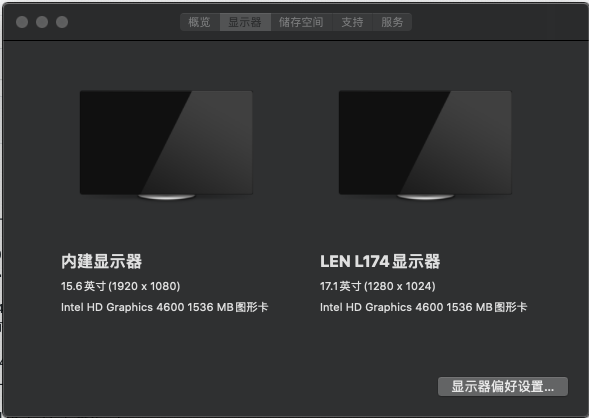
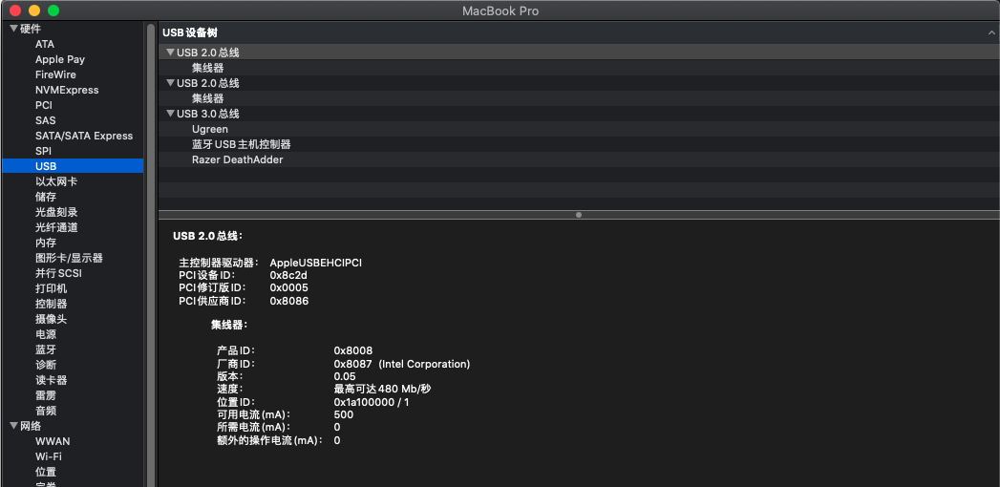
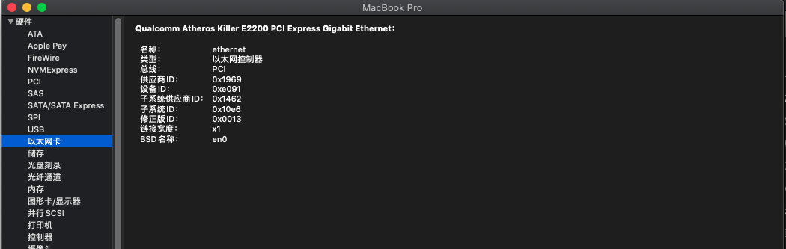
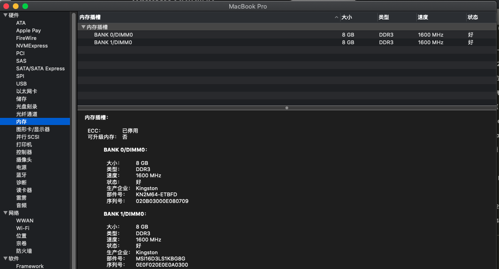
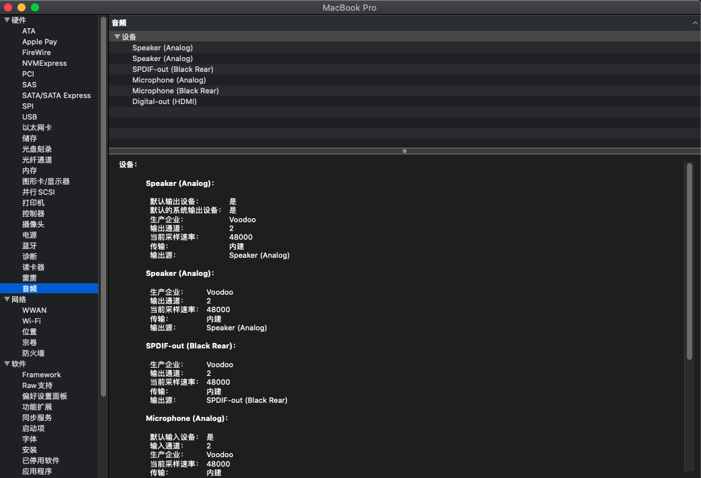

# MSI GE60-20C Hackintosh EFI（MAC OS Catalina）

--------[ 概览 ]----------------------------------------------------------------------------------

  电脑型号            微星 GE60 2OC\2OD\2OE 笔记本电脑
  
  操作系统            Windows 10 64位 ( 4.09.00.0904 )

  处理器              英特尔 第四代酷睿 i7-4800MQ @ 2.70GHz 四核
  
  主板                微星 MS-16GC ( 英特尔 Haswell - Lynx Point )
  
  显卡                Nvidia GeForce GTX 765M ( 2 GB / 微星 )
  
  核心显卡             英特尔 HD Graphics 4600
  
  内存                16 GB ( 金士顿 DDR3L 1600MHz )
  
  主硬盘               KSM480 ( 480 GB / 固态硬盘 )
  
  显示器               联想 LEN240B LEN L174 ( 17.1 英寸  )
  
  声卡                瑞昱 ALC892 @ 英特尔 Lynx Point  高保真音频
  
  网卡                鈺硕 Killer E2200 Gigabit Ethernet Controller / 微星
  
  无线网卡            Broadcom BCM943602CDP
  
--------------------------------------------------------------------------------------------------

## 本EFI基本完美

支持HDMI输出

WI-FI蓝牙免驱

支持隔空投传

音频使用的万能驱动稍有不完美

## 未解决的：
睡眠死机

独显未屏蔽

触摸板（设置未识别，但可以使用）

不能调整亮度

###

